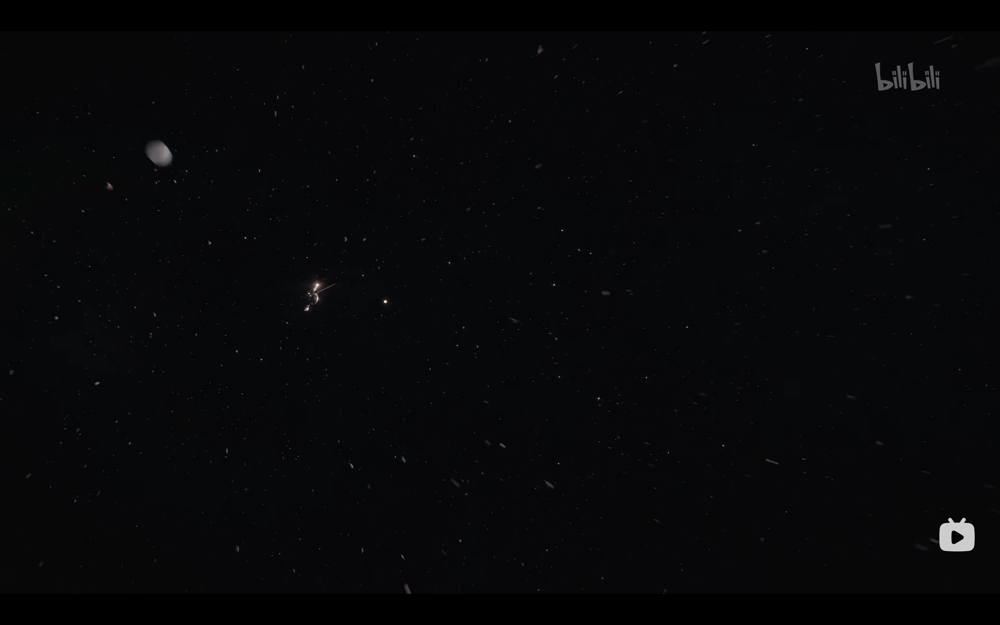
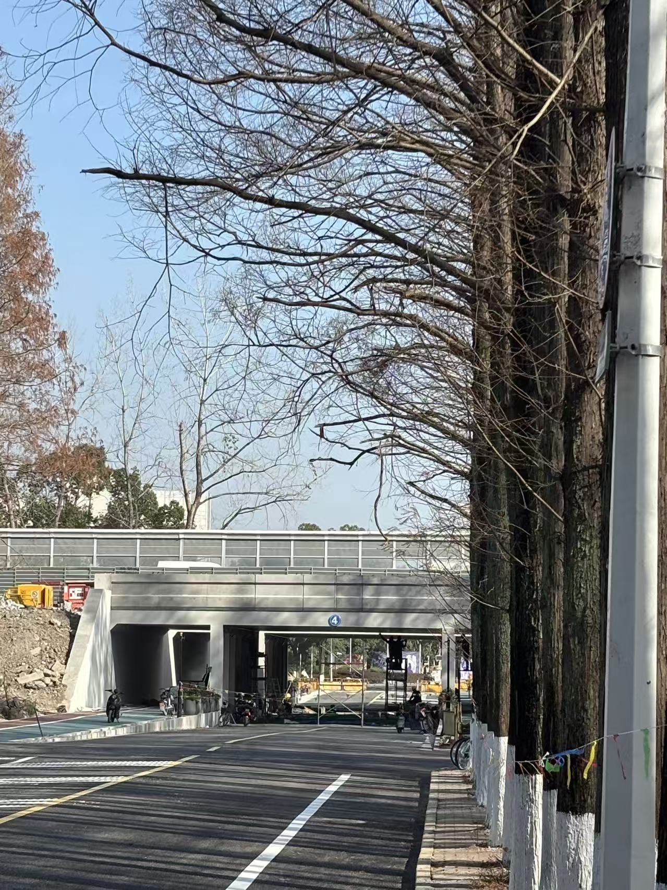

> 需要注意：这篇文章出于隐私保护原因经过大幅度的删改，可能会影响阅读。

[https://embed.music.apple.com/cn/playlist/stuffs-in-2025/pl.u-GgA5kZBcxy6WDar](https://embed.music.apple.com/cn/playlist/stuffs-in-2025/pl.u-GgA5kZBcxy6WDar)

### 45首歌曲

今年的年度歌单由45首歌构成，它们基本都选自我今年收听次数排行榜的前列，去掉了一些过多重复的，加入了几个带有特定故事背景的歌曲。

今年主要都在听欧美流行，比较喜欢的艺人有Taylor Swift, Sabrina Carpenter, Justin Bieber, charli xcx，国语主要在听陶喆、chilichill，日语流行有yuuri，藤井风和夜鹿。今年养成了以专辑听歌的习惯，比较喜欢的今年新专辑有SWAG II, STUPID POP SONGS, man‘s best friend和anti-people pleaser。

### 放下顾虑，勇敢去爱

今年有很多同龄人已经20岁了。不少20岁的同学和我袒露自己焦虑迷茫的心境，仿佛一夜之间自己变成大人，工作结婚生子近在眼前。很早之前我听说过一个相当悲观的说法：如果人生是对数的，那么18岁是人生的中点，而你我的生命也已经过半了。

在上面我列举了45件年度“小”事，是为了从一个更宏大的视角，去观察这一年那些重要的事情。这里的每一条，都花费了我不少的精力和时间，但即便如此，在一年的尺度上，它仅仅是这里的一行文字。今天我当然还记得暑假里一些失眠的夜晚内心的焦灼，也记得悠闲的午后里和范德林德帮度过的100多小时里的惊心动魄，只是当时间的尺度被无限地收缩，从年度或是从生命的角度观察，这些情绪就好像《宇宙探索编辑部》结尾的画面那样收缩进了一个“无限”的尺度里不见踪迹，而真正留下来的是这里的一行注解，或者说内心的一点经历，当时的心境却是相当难以比拟的。

不妨以更宏大的视角去审视平常的时间流逝：当下的焦虑与迷茫在几十年的生命里，甚至在一年的尺度里根本无足轻重，而真正能为生命留下注脚的乃是自己真真正正做过的事情：爱过一个人，认真做过几件事。2026年，不妨多问问自己：1年后或者50年后，我会认为自己当时应该怎么做，或者，我会因为什么而后悔？

希望这能让我停止内耗，**放下顾虑，勇敢去爱**，意犹未尽地体验当下。

如果要让我在2025年回答开头的问题，那么我会说焦虑和迷茫一直是人生中色彩的一部分，但并非人生的底色。迷茫的人会自然地找到答案，焦虑的人也总会开始生活，即使人不干预，人有限的生命进程也会推动人做出自然的选择。焦虑和迷茫的心境在生命这样更高的尺度上中无足挂齿，而做出的选择才构筑了人生。当然，不要美化没选择的那条路：人努力奋斗活出的人生不一定是最好的，顺其自然活出的人生也不一定是最差的，有目标那就勇敢去追逐；还没有明确的目标也要记得停止内耗，相信生命会自然地告诉你答案。

《宇宙探索编辑部》的结尾

### 结束时

今年并没有看什么番剧，硬要说的话有青猪最新一季，《薰香花朵凛然绽放》《小市民系列2》等一些当季番，此外我看了《神探夏洛克》和一部分《权力的游戏》，今年看了几本书，有《解忧杂货店》《莫失莫忘》《撒哈拉的故事》和一些推理小说，年初很喜欢雨穴的几本现代推理小说。看过的电影就不统计了，大多数都忘了。今年通关了一些游戏，有大表哥2、《邪恶冥刻》《求生之路2》，不确定还有没有别的。

明年我就要20岁了，哦耶。祝自己在2026年能放下内心暂时的焦虑与迷茫，勇敢地迈出步子，还有即使遇到压力也能告诉自己：

**都是“小事”！**

今年修了很久的四号桥洞，在年底终于要通车了。拍摄于12.30

2026新年快乐！