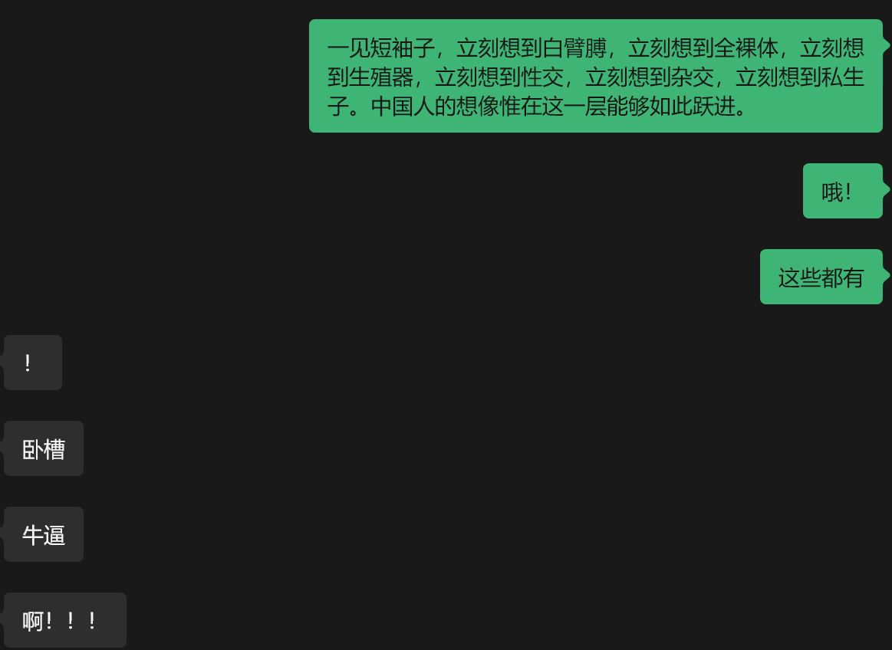
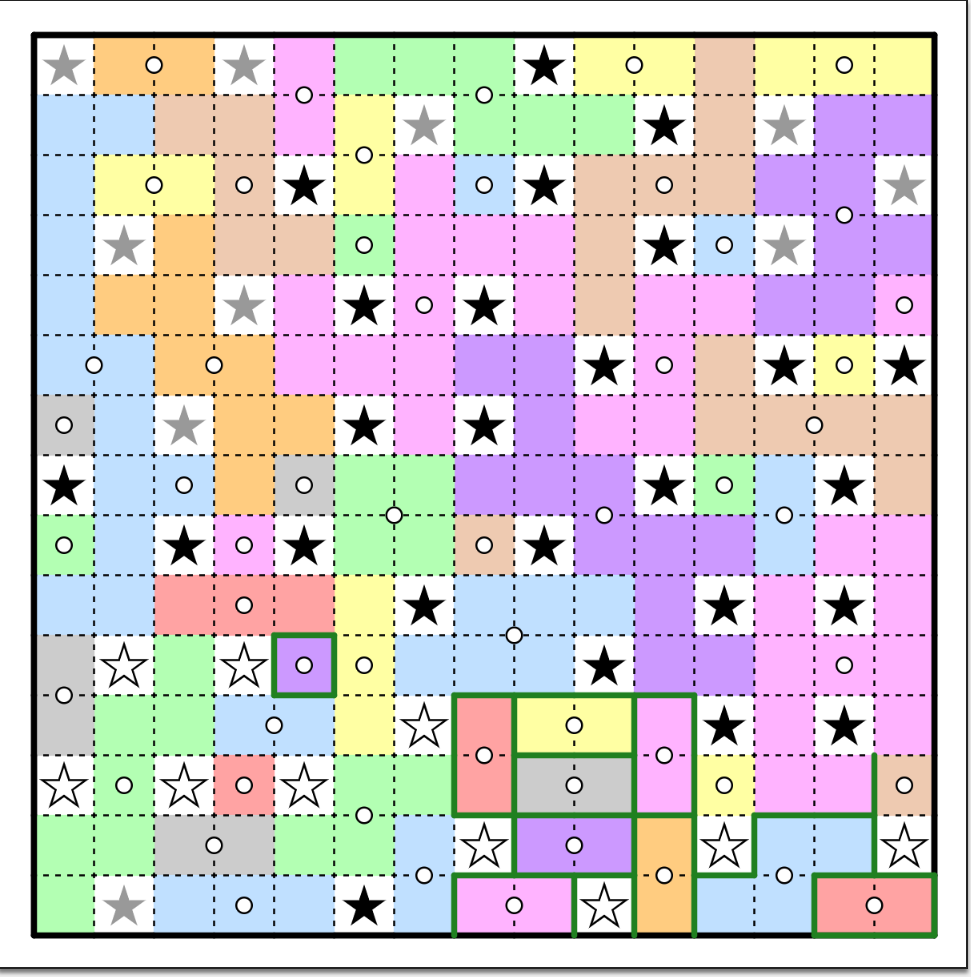
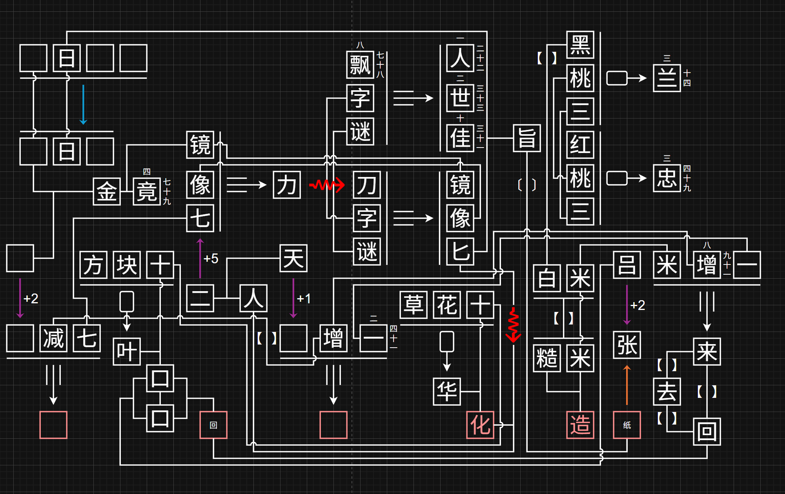

今年CCBC我加入了一支新人队伍，以170名左右的成绩完成了比赛。

4s的题目依旧很惊艳！整体上和c1314持平，小题上少了很多巨厚的题，做题的感受好了很多，但是（个人认为）剧情和fm没有c1314来得那么震撼，完赛的时候还稍微有一点小失望（。

印象深刻的题目有很多，包括指南区的《浮想联翩》《一位参赛者……》（解得巨丝滑），火药区的《柏拉图式相爱》《Galileo's Escapement Room》，造纸区的基本上所有题目，以及终章的指南树。

接下来小小地复盘一下吧！下面是一些影响比较深刻的题目：

## 序章

序章的时候是队员最全的一次，但是网站卡卡卡TT。序章有很多题是队友做的，包括这个区的meta，第二天早上起来发现已经进二区了，很开心。

### 四方谜

佩服4s……居然在一年前就做好了铺垫🙌晚上躺在床上睡觉前想明白了图案的含义，遂爬起床告知队友，后来的出题环节是队友做的。

### 小题大做

很精巧的小题！队友瞪出了大小写的重要性，不过卡在了小写L和大写i上哈哈哈。

### 相辅相成

前几天看七大做题，刚好看到在做这题，感叹自己还是有一点文化造纸的。

## 指南

指南区有好多精致的题目，喜爱程度仅次于造纸区！

### 浮想联翩

神级团建题，贡献了数不清的aha-moment。队友填词的时候我在《link it all》坐牢，关键词基本上都不是我填出来的。以至于后来没get到重点（谁做出来“生*器”不在群里说一声的😠）

后来回去填了几个词眼爆了“短袖子”和“白臂膊”，瞬间对上电波，太嗨了！

### **三星Galaxy**

今年队伍里没纸笔大佬了，也是要挑大梁了，花了两个小时左右把纸笔做出来了，队友瞪了提取。

感觉自己实力又上升了！

太累了！

### **你想Roll出怎样的比赛**

基本上一看到题目就知道要做什么了，但是不会做TT。ai在一部分做出了完全不对的答案：

下学期概统会不会学这个（？

### **Link It All**

这题太坐牢了！这次c16不太喜欢的题目之一，原因是队伍里没一个人玩塞尔达，且搜不到正确的解。

靠一个布瞪出俩字。

### **就是为了这点醋**

非常精致的meta matching题！喜欢最后的提取。

就是做的时候一直在想和[这个东西](https://www.bilibili.com/video/BV1qc411z7TH?)有没有联系……

### 复习资料

没搞懂机制，队友靠`uAAAAAAAAA`硬爆的哈哈哈。

### **一位参赛者……**

这题做得太丝滑了，全程的aha-moments基本都很快地get到了，爽。

### 指南：meta

在开提示前脑子里一闪而过了折东南西北的想法，然而并没有折……打印机派上用场了！

这题队友帮忙拼的碎片，但是少拼了一个，最后做完才发现😠

## 印刷

这个区好坐牢TT，在这里的某几题卡了很久。

### 图寻

be like:

### 只说明书

折纸太逆天了，滚吧。

### 只剩提取

提取太逆天了，滚吧。

## 火药

做完了印刷来做火药，瞬间感觉舒服了不少，题目厚度明显变薄了！

### **柏拉图式相爱**

这题chatGPT立大功！

### ？？？式相爱

完全明白要做什么了，但是脑子不够用TT不过很快就被backsolve了。

### **原来你也是厨神**

神秘原神题，我不会做饭！！

这届没有宝可梦怎么反而来原神了，难绷。

### **Galileo's Escapement Room**

有趣的密室逃脱题，好玩。

## 造纸

非常喜欢的史诗级团建区，太好玩啦！

要是单人刷这个区得孤独死。

### 叶子戏

买了鱼排到现在还没做，笑死了。

### 三字谜

汉化版，八字谜，落叶子，真牛逼。好题目，我喜欢，GPT，帮大忙。

### **2025年度解谜能力测试**

还是很有实力的：

### 你说话带括号

你怎么知道（）

似乎上线了这题的编辑器，创意工坊说是。不过怎么没人出题！

### 千字谜

太苦力了我说，幸好有编程大佬在。

### 造纸：meta

对上脑电波填了“文化造纸”，然后暴力出了第一个字。

## 终章

做到这里大家都特别急，基本等到点就提示全开了，少了一些aha的瞬间，属实可惜。

### 指南树

比较喜欢的一道题，可惜都是开提示获得的思路，感觉自己多想想应该能想到（。

### 最后的谜题：final meta

今年的fm居然没有用到小题/前面的meta答案，有一点点失望。感觉终章作为一个单独的区完全没有违和感，但是作为fm就有些单薄了。

最后没怎么拼图，靠logo的七个点眼爆出了答案，还是太有实力了。

## Summary

刷CCBC是每年暑假的保留节目了，虽然现在已经完赛很多天了但依旧有点戒断反应，每天还是想做做题（）。

C17再见吧！